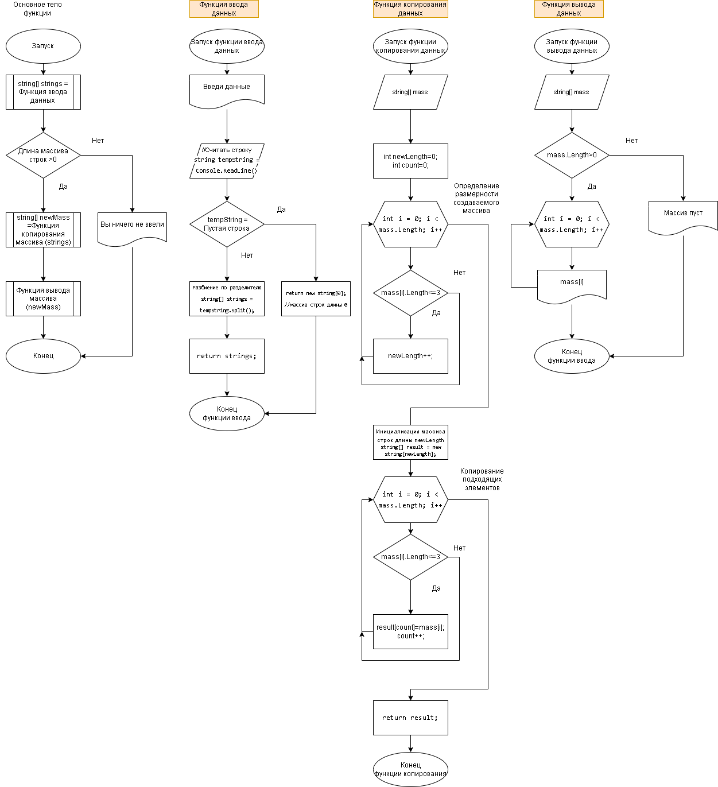

# Итоговая проверочная работа

## Задание:
Написать программу, которая из имеющегося массива строе формирует массив из строк, длина которых, меньше либо равна 3 символа. 
Первоначальный массим вводится с клавиатуры.
*Примеры:*

* ["hello","2","world",":-)"] - > ["2",":-)"]
* ["1234","126","computer science"] - > ["126"]
* ["Russia","Denmark","Kazan"] - > []

Ниже приведен алгоритм решения задачи.
